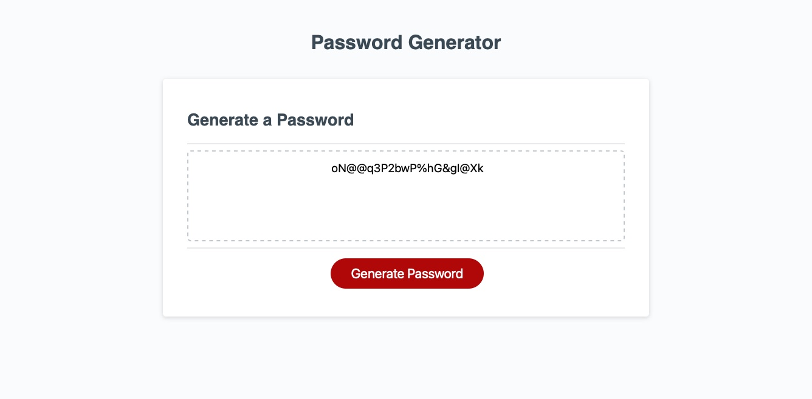

# JSPassword Generator-TT
3rd homework JavaScript: Password Generator

As lightning flashed out of our soon to be hero's window, the door flew open and an old woman slowly walked in.
As the hero stood mouth agape, the old woman had a simple journey for the young hero.  Her voice cracked as she let her desire be known.  "Build a password generator!"  As the last syllable dropped the thunder cracked as it to add empahsis to the statement.
The young relectant hero had so many questions, but was distracted by the flash of another bolt of ligthning, and as he looked back, the old lady had vanished.  So many questions went through his mind.  Why did this lady want a password generator?  What constrants should it have?
As fortune would have it, there was a small piece of paper on the floor, and it asked for the following things.

The reluctant novice pondered where he should start.  The simplest thing would be to write out everything that was needed.
He would need var to represent the following arrays:
Upper
Lower
numbers
and symbols

Unlike the old woman, the young hero would actually ask if the randomn person actually wanted a real password and would confirm if the selections were correct.  

He gathered his bag of holding and shoved all the variables in it.
He cast a magic spell that would combine only the selected desires of the unfortunate user who happened to need a new password and was out of original funny things that would make an awesome password and instead wanted a new password that would never be remembered.  In a brief flash of greed, the young novice thought of putting ad banners all over the site because he knew that if the user was this desperate, she would need another password, and it would most likly be to reset the very one that the bag of holding generated!  It is an endless loop of return users!!!!  Bwahahahah!! The fleeting moment passed, and the hero realized that this would be too evil to actually do.

Instead a simple interface would be created to ask the user to select what was needed.
It would combine the lists and the bag of holding would flow out the requested random password.  

As the final steps, that required a journey of looking up how to remove spaces and commas from the list, were finished, the old woman returned.

The hero handed off the generator and like that the mythical visitor vanished!

Our hero was left thinking... "You can have your password, if you can remember it...."

Random photo from website showing a password 

The links of Destiny:
Website
[password generator](https://dertodd.github.io/Homework-03-JSPassword-TT/)
GitHub
[github repository](https://github.com/DerTodd/Homework-03-JSPassword-TT)